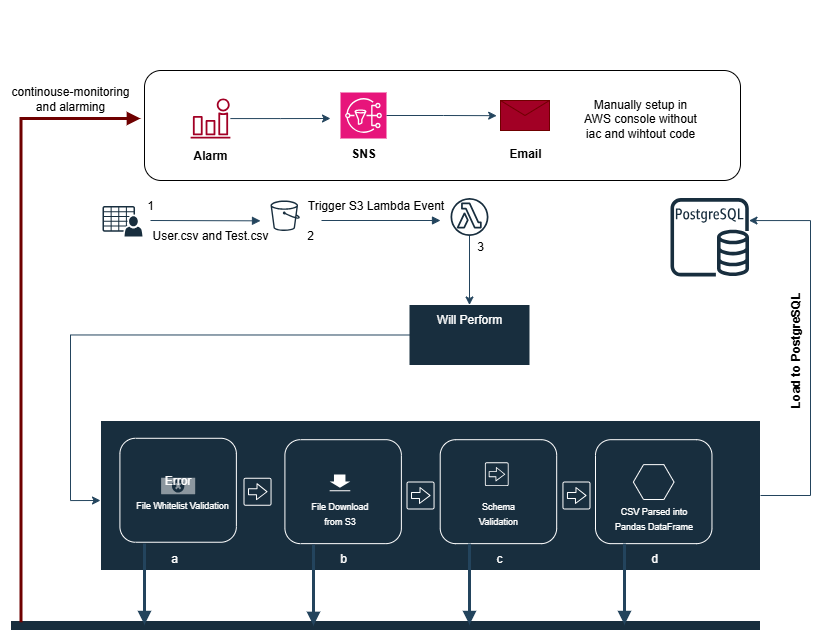

# Scientific Data Ingestion Pipeline (S3 → PostgreSQL via AWS Lambda)

## Overview

This module automates the ingestion of structured scientific data (CSV format) from AWS S3 into a PostgreSQL datastore. It is designed to operate in a cloud-native, event-driven architecture using AWS Lambda for near real-time responsiveness to new dataset uploads.  
[Read more](https://aws.amazon.com/blogs/big-data/serverless-data-processing-in-action-aws-lambda-and-amazon-s3/) on how AWS Lambda and S3 work together for serverless ingestion.

---

## Functional Description

Upon the creation of an object in S3 (conforming to a predefined naming schema), the Lambda function is triggered. The script performs the following deterministic steps:

1. **Event Decode:** Extracts the S3 bucket name and object key from the event payload.  
   [Read more](https://docs.aws.amazon.com/lambda/latest/dg/with-s3.html) about using S3 to trigger Lambda.
2. **Validation:** Verifies the object name against a known list of target schemas (`TABLE_MAPPING`).
3. **Extraction:** Retrieves the CSV data directly from S3 using the `boto3` client.  
4. **Transformation:** Parses CSV into a pandas `DataFrame`.  
5. **Load:** Appends or replaces the corresponding table in a PostgreSQL instance hosted on Amazon RDS using SQLAlchemy.  
   [Read more](https://www.postgresql.org/docs/current/sql-copy.html) on optimized ingestion strategies in PostgreSQL.

---

##  Architecture



1. **S3 triggers** a Lambda function whenever `users.csv` or `test.csv` is uploaded.
2. **The Lambda validates** the filename, downloads the file, and parses it into a DataFrame.
3. **It performs strict schema validation** against a predefined structure for each table.
4. **On success, it loads the data** into PostgreSQL using SQLAlchemy.
5. **Any success or failure triggers an SNS notification**, sending an email, but first going through the alert and SNS to raise alarms.  
---

## Python Modules and Libraries

* `boto3`: AWS SDK for S3 operations. [Read more](https://boto3.amazonaws.com/v1/documentation/api/latest/index.html)
* `pandas`: Used for memory-safe CSV parsing. [Read more]
* `sqlalchemy`: PostgreSQL ORM for safe ingestion. [Read more](https://docs.sqlalchemy.org/)
* `psycopg`: PostgreSQL driver. 
* `io`, `os`: Standard libraries for stream handling and environment interaction.

---

## Configuration Parameters

* **Environment**
  * AWS Lambda runtime: Python 3.10+
  * IAM role with S3 read and RDS connectivity permissions (default Lambda execution role is assumed)  
* **Mapping Schema**
  * Defined in `TABLE_MAPPING`. All files not explicitly defined are rejected to ensure data lineage and table safety.

---

## Example Files

```python
TABLE_MAPPING = [
    "users.csv",
    "test.csv"
]
